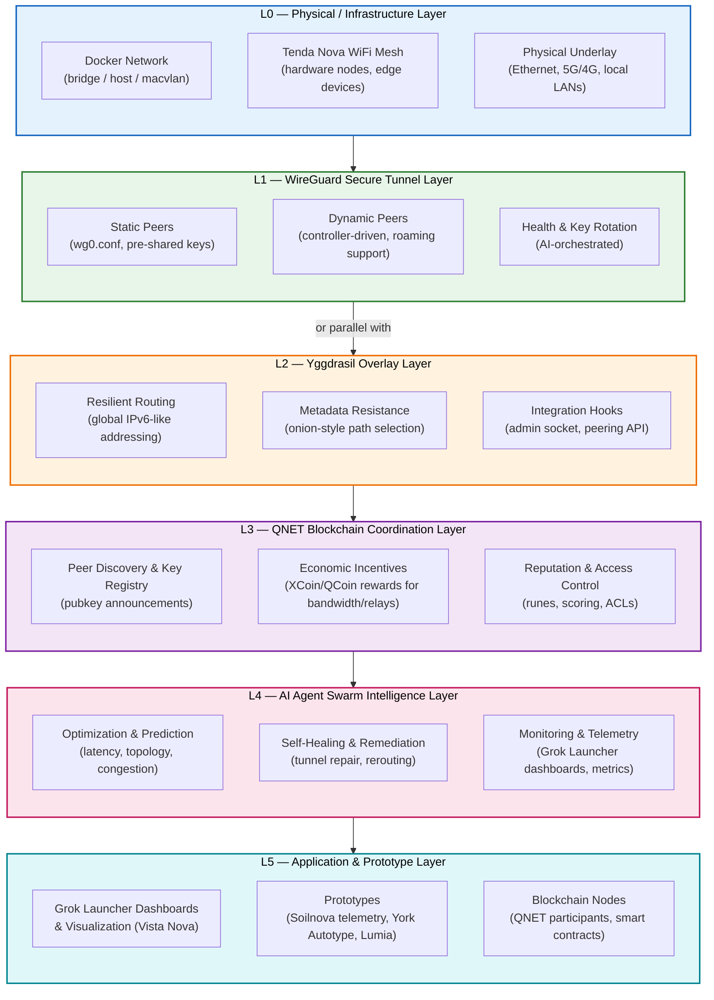
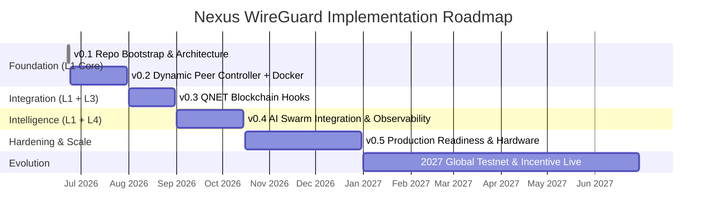

# Nexus Secure Mesh Architecture

**Layered communication fabric for the Nexus ecosystem** (xMesh / NovaNet / QNET + Yggdrasil + WireGuard + Blockchain + AI Swarms + Prototypes).

This document expands on the core architecture used by `nexus-wireguard` and the broader NovaNet prototyping initiative (Esslinger & Co.).

---

## Core Layered Diagram



*Layers are **composable** — WireGuard can sit under, over, or parallel to Yggdrasil depending on use case (performance vs privacy trade-offs).*

---

## Refined v0.2 Implementation Details (Dynamic Peer Controller + Docker)

**Phase Window**: June 24 – July 31, 2026  
**Status**: Planning / Early Implementation  
**Owner**: `nexus-wireguard` (L1 focus)  
**Goal**: Deliver a functional, containerized dynamic WireGuard controller that can be driven by configuration and later by higher layers (L3 QNET discovery + L4 AI agents).

This section provides **actionable, refined implementation details** for v0.2 — going far beyond the high-level roadmap. It covers scope, architecture, interfaces, tech choices, edge cases, testing strategy, and integration hooks.

### 1. Scope & Feature Priorities for v0.2

**In Scope (Must Have)**
- Dynamic runtime management of WireGuard peers (add, remove, update endpoint, update allowed-ips)
- Support for multiple WireGuard interfaces (wg0, wg1, …) managed from one controller
- Roaming / endpoint update handling (detect IP change or accept external updates)
- Structured health monitoring and metrics export (interface + per-peer stats)
- Basic key lifecycle support (generate keys, rotate keys with grace period)
- Docker-first deployment model with multi-arch support (amd64 + arm64)
- Clean separation between core logic and configuration
- CLI + config-file driven operation (prepare for future API)
- Comprehensive logging and error handling

**Out of Scope for v0.2 (Deferred)**
- Full QNET blockchain integration (v0.3)
- AI agent command interface / self-optimization loops (v0.4)
- Production-grade persistent state / clustering
- Post-quantum cryptography
- Advanced multicast or userspace WireGuard extensions
- Web UI or complex dashboard (Grok Launcher integration comes in v0.4)

**Stretch Goals (if time permits)**
- Simple Prometheus-compatible metrics endpoint
- Basic persistent peer database (SQLite or JSON)
- Automatic MTU tuning helper based on underlay detection

### 2. Proposed Module & Directory Structure

```
nexus-wireguard/
├─ controller/
│   ├─ __init__.py
│   ├─ wg_manager.py          # Core WireGuard interface management (wg set / wg show wrappers)
│   ├─ peer_manager.py        # High-level peer lifecycle, roaming logic, state
│   ├─ health_monitor.py      # Collects wg show + interface stats, computes health scores
│   ├─ metrics_exporter.py    # Structured output (JSON, Prometheus, or simple HTTP)
│   ├─ key_manager.py         # Key generation, rotation orchestration, secure storage helpers
│   ├─ config.py              # Pydantic models for configuration
│   ├─ cli.py                 # Typer / Click CLI entrypoint
│   └─ daemon.py              # Long-running mode (watch config, periodic health checks)
├─ docker/
│   ├─ Dockerfile
│   ├─ docker-compose.yml     # Example multi-node setup
│   └─ entrypoint.sh
├─ configs/
│   ├─ example/
│   │   ├─ wg0.conf.template
│   │   └─ controller.yaml      # Example controller config
│   └─ README.md
├─ tests/
│   ├─ test_wg_manager.py
│   ├─ test_peer_manager.py
│   └─ integration/
├─ docs/
│   └─ v0.2-implementation-plan.md   # This refined spec (or link here)
├─ pyproject.toml / requirements.txt
└─ README.md
```

**Design Principles for v0.2**
- Prefer **reliability and simplicity** over premature optimization.
- Use **subprocess** + `wg` / `wg-quick` CLI for maximum compatibility and auditability (avoid fragile kernel netlink bindings in first version).
- Make the controller **observable by default** (rich logging + structured metrics).
- Keep state in memory for v0.2; persistence is a v0.3+ concern.
- Configuration-driven with clear validation (Pydantic).

### 3. Core Components & Responsibilities

#### `wg_manager.py`
- Thin, well-tested wrapper around `wg` and `ip` commands.
- Methods: `add_peer()`, `remove_peer()`, `update_peer_endpoint()`, `update_allowed_ips()`, `get_interface_status()`, `get_peer_status()`.
- Handles interface creation (`ip link add`) and basic bring-up if needed.
- Strong error handling and parsing of `wg show` JSON output (when available) or text fallback.

#### `peer_manager.py`
- High-level orchestrator.
- Maintains desired vs actual state.
- Implements roaming logic: accept external endpoint updates or detect local IP changes (via netifaces or similar).
- Supports both "static config" mode and "dynamic managed" mode.
- Exposes hooks for future L3 (QNET peer announcements) and L4 (AI commands).

#### `health_monitor.py`
- Periodic collection of:
  - Interface stats (rx/tx bytes, errors)
  - Per-peer latest handshake, transfer, RTT estimates (where possible)
  - Calculated health score (simple weighted formula in v0.2)
- Detects "stale" peers (no handshake for configurable threshold).
- Emits structured events for logging / metrics.

#### `metrics_exporter.py`
- Outputs in multiple formats:
  - JSON to stdout / file (easy for v0.2)
  - Prometheus exposition format (optional HTTP endpoint)
  - Simple internal dict for in-process L4 agents later
- Designed so L4 AI agents and Grok Launcher can consume it with minimal parsing.

#### `key_manager.py`
- Key generation using `wg genkey` / `wg pubkey`.
- Basic rotation workflow: generate new keypair, add grace period for old key, then remove.
- Secure storage recommendations (env vars, Docker secrets, or future TPM/HSM integration).
- Prepares the interface for future decentralized key distribution via QNET.

### 4. Configuration Model (High-Level)

Example `controller.yaml`:

```yaml
controller:
  interfaces:
    - name: wg0
      listen_port: 51820
      private_key: ${WG0_PRIVATE_KEY}   # or path to file
      peers:
        - public_key: "..."
          allowed_ips: ["10.0.0.2/32"]
          endpoint: "203.0.113.50:51820"
          persistent_keepalive: 25
        # more peers...
  health:
    check_interval_seconds: 30
    stale_handshake_threshold_seconds: 180
  metrics:
    export_format: ["json", "prometheus"]
    prometheus_port: 9090
  roaming:
    enabled: true
    detection_method: "external_update"   # or "local_ip_change"
```

Validation via Pydantic models with clear error messages.

### 5. Docker & Deployment Model

**Multi-arch support** from day one (important for Tenda Nova ARM devices and mixed environments).

`Dockerfile` highlights:
- Base: `python:3.11-slim` or `alpine` for size
- Install `wireguard-tools` + `iproute2`
- Non-root user where possible (capabilities for network admin)
- Healthcheck using the controller’s own health endpoint

`docker-compose.yml` example will demonstrate:
- Multiple nodes on a Docker network (simulating L0)
- One controller managing one or more wg interfaces
- Yggdrasil running in parallel or stacked (for hybrid testing)
- Volume mounts for persistent keys/config (with warnings)

**Networking considerations**:
- Use `host` or `macvlan` networking mode for best WireGuard performance in production-like tests.
- Document bridge mode limitations (NAT, multicast issues).

### 6. Key Management & Rotation Strategy (v0.2 Foundation)

- Controller can generate fresh keypairs on demand.
- Supports "graceful rotation": add new public key to peers while old key still works for a configurable window, then remove old key.
- Keys never logged in plaintext.
- Environment variable or Docker secret injection for private keys in v0.2.
- Prepares clean extension points for v0.3 (QNET-published keys) and v0.4 (AI-triggered rotation).

**Edge Cases Addressed**:
- Rotation while active traffic is flowing
- Partial failure during rotation (rollback capability)
- Key compromise detection (future L4 anomaly detection will feed this)

### 7. Health Monitoring & Metrics Details

Collected data points (per interface + per peer):
- `latest_handshake`, `transfer_rx/tx`, `persistent_keepalive`
- Calculated: `time_since_last_handshake`, `estimated_rtt` (best-effort), `health_score`
- Interface level: `rx_bytes`, `tx_bytes`, `errors`, `dropped`

Export formats:
- JSON lines (easy to tail / ship)
- Prometheus text exposition (for existing monitoring stacks)
- In-memory for direct L4 agent consumption (future)

**Nuance**: WireGuard itself does not expose RTT directly. v0.2 will use best-effort estimation or simply surface raw data for L4 agents to compute higher-order metrics.

### 8. Integration Hooks (Designed for Future Layers)

Even in v0.2 we design clean extension points:

- **L2 (Yggdrasil)**: Document how to run Yggdrasil over/parallel to managed WireGuard interfaces. Provide example configs.
- **L3 (QNET)**: `peer_manager` will have pluggable "peer source" — static config today, QNET listener in v0.3.
- **L4 (AI Swarm)**: Health metrics and peer state exposed via simple internal API / shared memory or HTTP. AI agents will later call methods like `request_peer_update()` or `trigger_key_rotation()`.
- **L0 (Physical/Docker)**: Clear networking requirements documented; health monitor can surface underlay issues when detectable.

### 9. Testing & Validation Strategy

**Unit Tests**:
- Mock `wg` / `ip` command output for deterministic testing of managers.
- Pydantic config validation tests.
- Key rotation state machine tests.

**Integration Tests**:
- Local multi-container test using Docker Compose (3–5 nodes).
- Simulate roaming by changing endpoint and verifying update.
- Health monitor accuracy under packet loss / high latency (using `tc` or similar).

**Manual / End-to-End**:
- Deploy on real Tenda Nova hardware (arm64) if available during phase.
- Hybrid test: WireGuard + running Yggdrasil node.
- Performance baseline (throughput, CPU under load).

**Success Criteria (Measurable)**
- Controller can dynamically add/remove 50+ peers with < 2s convergence.
- Health metrics exported and visible in JSON + Prometheus format.
- Docker image runs cleanly on both amd64 and arm64.
- Roaming endpoint update works within 30 seconds of change.
- All critical paths have unit + integration test coverage > 70%.

### 10. Risks, Edge Cases & Mitigations Specific to v0.2

| Risk / Edge Case                        | Impact | Mitigation in v0.2                                      |
otes |
|-----------------------------------------|--------|---------------------------------------------------------|------|
| MTU & fragmentation with Yggdrasil     | High   | Provide recommended MTU values + PMTUD helper script   | Document clearly |
| Unreliable `wg show` parsing           | Medium | Robust text + JSON fallback parser + extensive tests   | - |
| Roaming on CGNAT / strict NAT          | Medium | Support external endpoint injection; document limitations | Prepare for relay in later phase |
| Key rotation during active sessions    | Medium | Grace period + atomic peer updates                     | Test thoroughly |
| Docker networking performance        | Medium | Recommend `host`/`macvlan`; document bridge limitations | - |
| Resource usage on low-end ARM (Tenda)  | Low    | Profile early; keep Python lightweight + consider Rust later | - |
| State loss on controller restart       | Medium | In-memory only in v0.2; document re-sync on startup    | Persistence in v0.3 |

### 11. Suggested Tech Stack for v0.2

- **Language**: Python 3.11+ (fast iteration, excellent Docker ecosystem, good for future AI integration)
- **CLI**: Typer (modern, type-safe) or Click
- **Config**: Pydantic v2 + PyYAML
- **WireGuard interaction**: `subprocess` + `wg` / `ip` commands (most reliable cross-platform approach for v0.2)
- **Optional**: `pyroute2` for more advanced netlink work if subprocess proves limiting
- **Metrics**: `prometheus_client` library (optional but recommended)
- **Testing**: `pytest`, `pytest-docker`, `responses` for mocking
- **Container**: Multi-stage Docker build, `docker buildx` for multi-arch

**Why not Rust in v0.2?** Rust is excellent for the final high-performance daemon, but Python allows much faster delivery of working functionality and easier integration with the AI/agent side of Nexus in early phases. We can rewrite hot paths or the entire controller in Rust in v0.5+ if profiling demands it.

### 12. Milestone Breakdown Inside v0.2

**Early July (Week 1–2)**
- Core `wg_manager` + `peer_manager` with static + dynamic peer support
- Basic CLI and config loading
- Initial Docker image that can bring up a managed interface

**Mid July (Week 3)**
- Health monitor + metrics export (JSON + Prometheus)
- Roaming / endpoint update logic
- Key generation + basic rotation workflow

**Late July (Week 4)**
- Full test suite + integration tests with Docker Compose
- Refined documentation and example configs
- Stretch: Prometheus endpoint + simple persistent peer list
- Phase retrospective and v0.3 planning kickoff

---

## Implementation Roadmap & Timeline

This section provides a **concrete, time-bound implementation plan** for `nexus-wireguard` aligned with the layered architecture and the broader NovaNet / Esslinger & Co. prototyping goals.

The timeline assumes parallel development across the Nexus stack (QNET blockchain maturing, AI agent swarm capabilities expanding via Lyra/Xen/Grok Launcher, prototype hardware availability, and Yggdrasil stability). Dates are target windows and will be adjusted based on dependencies and learnings from early deployments.

### Visual Timeline (Gantt Chart)



### Phase Details

#### Phase 0 / v0.1 — Foundation & Architecture (Completed: June 22–23, 2026)

**Status**: Done

**Deliverables**
- Public GitHub repository with MIT license and protective `.gitignore`
- Comprehensive `README.md` with vision, nuances, and quick-start guidance
- Detailed `docs/ARCHITECTURE.md` with color-coded Mermaid layer diagram, layer responsibilities, edge cases, data flows, and this timeline
- Initial simplified ASCII diagram retained in main README for quick reference

**Success Criteria**
- Clear ownership of L1 (WireGuard) established with hooks to all other layers
- Documentation sufficient for contributors and parallel Nexus workstreams to align

---

#### Phase 1 / v0.2 — Dynamic Peer Controller & Containerization (Target: June 24 – July 31, 2026)

**Goal**: Move from static configs to a functional, controllable L1 implementation that can be orchestrated by higher layers.

**Key Deliverables**
- Python (or Rust) `controller/` module for dynamic WireGuard peer management (`wg set`, interface bring-up/teardown, roaming endpoint updates)
- Health monitoring exporter (interface stats, peer RTT/loss, key age) consumable by L4 AI agents and Grok Launcher
- Docker-ready multi-arch images + example `docker-compose.yml` aligned with L0 networking modes
- Static + dynamic example configurations in `configs/example/`
- Basic key generation and rotation helpers
- Initial test harness (local multi-node simulation)

**Dependencies**
- Stable Linux kernel with WireGuard module (or wireguard-go) in development environment
- Basic Yggdrasil node for parallel/overlay testing
- Early Grok Launcher dashboard skeleton (for metrics visualization)

**Success Criteria**
- Can bring up dynamic tunnels between 3+ nodes with automatic peer updates
- Metrics exported in structured format (Prometheus/OpenMetrics or simple JSON)
- Dockerized deployment works on amd64 and arm64 (Tenda Nova class hardware)

**Risks & Mitigations**
- MTU and nesting issues with Yggdrasil → extensive testing + documented safe defaults
- Roaming behavior on changing networks → focus on endpoint update logic early

---

#### Phase 2 / v0.3 — QNET Blockchain Integration (Target: August 2026)

**Goal**: Close the loop between L1 and L3 so that peer discovery, key distribution, and initial reputation filtering become decentralized.

**Key Deliverables**
- QNET client integration (publish WireGuard pubkeys + endpoints, listen for announcements)
- Reputation-weighted peer selection logic (only auto-connect to nodes above a configurable reputation threshold)
- Simple on-chain event handling for key rotation triggers or policy updates
- Documentation of bootstrap / seed node strategy for early network
- Example of paid/ incentivized peering (future XCoin/QCoin hooks)

**Dependencies**
- Functional QNET testnet or local blockchain node with rune/pubkey registry capabilities
- Stable L2 Yggdrasil for reachability during discovery
- Basic reputation scoring model from L3 team

**Success Criteria**
- New node can discover and establish WireGuard tunnels to high-reputation peers without manual key exchange
- Key publication and listening works end-to-end on testnet
- Clear separation between on-chain commitments and off-chain tunnel data

**Risks & Mitigations**
- Token volatility or incentive misalignment → start with reputation-only (no economic value) and add incentives later
- Sybil / spam peers → strong emphasis on reputation + rate limiting in v0.3

---

#### Phase 3 / v0.4 — AI Agent Swarm Integration & Observability (Target: September – mid-October 2026)

**Goal**: Enable L4 agents (Xen technical + Lyra emotional/creative) and Grok Launcher to actively optimize and heal the L1 fabric.

**Key Deliverables**
- Rich metrics + structured events from WireGuard controller consumable by AI swarm
- API / command interface allowing AI agents to request tunnel creation, peer removal, or key rotation
- Self-healing logic prototype (AI detects failing tunnel → proposes alternative peer or reroute via Yggdrasil)
- Grok Launcher dashboard widgets showing live tunnel topology, health heatmaps, and AI-proposed actions
- Feedback loop: agents measure outcome of their changes and reinforce successful policies

**Dependencies**
- Maturing L4 AI agent swarm framework (state management, prompt engineering, skilllogin persistence)
- Grok Launcher UI ready to embed custom widgets and visualizations
- Rich telemetry from L0 (physical link quality) and L2 (Yggdrasil routing metrics)

**Success Criteria**
- AI agent can autonomously improve average mesh RTT or reliability by reconfiguring WireGuard peers
- Human operator can review and approve/reject AI-proposed changes via Grok Launcher
- Closed-loop observability from tunnel stats → agent decision → outcome measurement works

**Risks & Mitigations**
- Agent drift or destabilizing changes → conservative defaults, circuit breakers, and mandatory human review for production meshes in early versions
- Coordination overhead between many agents → leader election or phased rollout of autonomy

---

#### Phase 4 / v0.5 — Production Readiness, Hardware & Scale (Target: late October – December 2026)

**Goal**: Make the L1 implementation robust enough for real prototype deployments and larger meshes, with hardware integration.

**Key Deliverables**
- Tenda Nova hardware optimization (WiFi backhaul awareness, power/thermal considerations, ARM-specific builds)
- Large-mesh testing harness and simulation tools (hundreds of nodes)
- Advanced features: post-quantum hybrid key exchange experiments, multicast support exploration, formal methods / verification hooks
- Production-grade security hardening (key storage, audit logging, rate limiting)
- Initial integration with Soilnova / Vista Nova / York Autotype / Lumia prototypes over secure tunnels
- Public or semi-public testnet participation guidelines

**Dependencies**
- Availability of Tenda Nova and prototype hardware for testing
- Stable QNET mainnet or advanced testnet with economic incentives live
- AI swarm sufficiently reliable for semi-autonomous operation
- Broader Nexus corporate/legal readiness (Esslinger & Co. structures, compliance for crypto use in EU)

**Success Criteria**
- Stable operation of 50+ node mesh with mixed static/dynamic WireGuard + Yggdrasil
- Measurable improvement in prototype data reliability (Soilnova telemetry, Vista Nova streams) when using nexus-wireguard tunnels
- External contributors or early adopters can join the testnet following documented process

**Risks & Mitigations**
- Hardware variability on Tenda Nova → extensive compatibility testing + fallback to software-only modes
- Regulatory uncertainty around incentives/crypto in Germany/EU → focus first on reputation and technical coordination; add economic layer carefully

---

#### Phase 5 / 2027 — Global Deployment, Incentives & Ecosystem Maturity

**Goal**: Transition from prototyping to a self-sustaining, economically incentivized global Nexus mesh fabric where WireGuard is a core, battle-tested primitive.

**Key Focus Areas**
- Live XCoin/QCoin incentive mechanisms for bandwidth providers and relay nodes
- Large-scale global testnet with geographic diversity
- Deep integration across all prototypes (Soilnova environmental data, Vista Nova visualization, automation loops)
- Production use by Esslinger & Co. internal and partner nodes
- Post-quantum cryptography migration path as standards mature
- Formal verification or high-assurance components for critical control paths
- Open-source community growth and governance model

**Success Vision**
`nexus-wireguard` (L1) + the rest of the Nexus stack enables a resilient, privacy-respecting, economically self-reinforcing decentralized communication infrastructure that supports autonomous AI agent swarms and real-world prototype deployments at global scale.

---

### Timeline Rationale & Assumptions

- **Aggressive but achievable pacing**: Early phases (v0.2–v0.3) move quickly because L1 is relatively self-contained. Later phases slow down as dependencies on L3 (QNET incentives/reputation) and L4 (mature AI agents + Grok Launcher) become critical.
- **Learning loops**: Each phase includes explicit feedback mechanisms (metrics → AI agents → policy changes) so the system improves itself as we build.
- **Risk buffer**: Later 2026 and 2027 phases include buffer for integration surprises, hardware quirks, and regulatory considerations (especially important for incentive mechanisms in the EU/Germany context).
- **Flexibility**: Dates are targets. The living nature of this document means we will update the Gantt and phase details as we learn from real deployments.

### How the Timeline Supports Self-Improvement

The phased approach is deliberately designed to bootstrap the recursive improvement loop:

1. v0.2 gives reliable tunnels + exportable metrics (foundation for observation).
2. v0.3 adds decentralized discovery (reduces human configuration burden).
3. v0.4 introduces AI agents that can act on observations and measure results.
4. v0.5 and beyond close the economic loop (L3 incentives reinforce good behavior discovered by L4).

This creates the conditions for the mesh fabric to become increasingly autonomous while remaining auditable and aligned with human intent — core to the Nexus vision.

---

## Layer-by-Layer Breakdown

### L0 — Physical / Infrastructure Layer

**Responsibilities**
- Provide the raw connectivity substrate (Docker networking, Tenda Nova WiFi mesh hardware, Ethernet, cellular backhaul).
- Handle physical topology, power, environmental constraints (important for Soilnova outdoor sensors or mobile prototypes).

**Key Nuances & Edge Cases**
- Docker networking modes (bridge vs host vs macvlan) affect WireGuard performance and multicast behavior.
- Tenda Nova hardware: WiFi mesh backhaul quality varies with distance, interference, firmware; monitor RSSI and channel utilization.
- Intermittent connectivity (mobile nodes, solar-powered prototypes) requires robust roaming and tunnel re-establishment logic in upper layers.
- MTU discovery at this layer is foundational — misconfigurations cascade into fragmentation issues higher up.

**Integration Points**
- Exposes interfaces that L1 (WireGuard) binds to.
- Telemetry (link quality, throughput) fed upward to AI swarm for optimization.

---

### L1 — WireGuard Secure Tunnel Layer (Primary Focus of This Repo)

**Responsibilities**
- Establish confidential, authenticated, high-performance point-to-point and group tunnels.
- Support both static configurations and dynamic peer management (roaming, on-demand tunnels).
- Provide the confidentiality/integrity foundation that higher layers can trust.

**Key Nuances & Edge Cases**
- **Performance vs Privacy Trade-off**: Stacking WireGuard directly under Yggdrasil gives speed but less metadata protection. Running Yggdrasil under WireGuard (or parallel) changes the threat model.
- **Key Management**: Initial bootstrap, rotation, and revocation are non-trivial in a decentralized mesh. `nexus-wireguard` will provide controller hooks; long-term integration with L3 (QNET) for decentralized key registry.
- **MTU & Fragmentation**: WireGuard adds ~80 bytes. Nested tunnels require careful tuning (typical safe starting point: 1280–1420). Always enable PMTUD.
- **NAT Traversal & Roaming**: Excellent in most scenarios, but symmetric NAT/CGNAT or strict firewalls need relays or IPv6 preference (where Yggdrasil helps).
- **Monitoring**: Expose `wg show` metrics + interface stats to L4 AI agents for predictive maintenance.

**Implementation Priorities (nexus-wireguard)**
- Config templating and validation
- Dynamic peer controller (Python/Rust)
- Health checks and automated key rotation
- Docker-ready multi-arch images
- Integration points for L2 (Yggdrasil admin socket) and L3 (QNET pubkey announcements)

---

### L2 — Yggdrasil Overlay Layer

**Responsibilities**
- Global addressing (cryptographic IPv6-like addresses) independent of underlying IP changes.
- Resilient, self-organizing routing across heterogeneous underlays (including WireGuard tunnels).
- Metadata resistance through path selection and encryption.

**Key Nuances & Edge Cases**
- Yggdrasil can run **over** WireGuard (trusted high-speed links) or **under** it (WireGuard as an encrypted underlay for specific peer groups).
- Peering is flexible but can be noisy in large meshes — use `nexus-wireguard` + reputation from L3 to filter peers.
- Excellent complement to WireGuard for nodes that move frequently or operate behind difficult NAT.

**Synergies with WireGuard**
- WireGuard provides **speed + confidentiality** between trusted nodes.
- Yggdrasil provides **reachability + metadata resistance** across the wider network.
- Hybrid setups are a core research area for `nexus-wireguard` v0.3+.

---

### L3 — QNET Blockchain Coordination Layer

**Responsibilities**
- Decentralized peer discovery and public key registry (solve the bootstrap problem for WireGuard).
- Economic incentives (XCoin/QCoin) for providing bandwidth, relays, and uptime.
- Reputation scoring and access control (runes, smart-contract-like policies).
- Event logging and audit trail for the mesh fabric.

**Key Nuances & Edge Cases**
- **Token volatility & incentives**: Must design rewards that actually encourage healthy mesh behavior without encouraging spam or Sybil attacks.
- **On-chain vs off-chain**: Heavy data (full peer lists, large configs) should stay off-chain; blockchain used for commitments, reputation roots, and discovery indexes.
- **Bootstrapping the registry**: Early network needs seed nodes or trusted introducers; later becomes more permissionless via reputation.

**Integration with `nexus-wireguard`**
- Publish WireGuard public keys and endpoints to QNET.
- Listen for peer announcements and automatically establish tunnels to high-reputation nodes.
- Use on-chain events to trigger key rotation or policy updates.

---

### L4 — AI Agent Swarm Intelligence Layer

**Responsibilities**
- Continuous optimization of the entire stack (topology, tunnel selection, routing policies).
- Predictive healing: detect failing tunnels or degrading links before they impact applications.
- Telemetry aggregation and visualization (feed Grok Launcher dashboards).
- Self-improving loops: agents experiment with configurations, measure outcomes, and evolve strategies.

**Key Nuances & Edge Cases**
- **Agent drift & safety**: Self-improvement must stay within safe bounds (rate limits on config changes, human-in-the-loop for critical production meshes).
- **Observability**: Needs rich, low-latency metrics from L0–L3. `nexus-wireguard` must expose structured stats.
- **Coordination overhead**: Too many agents making simultaneous changes can destabilize the mesh — requires consensus or leader election mechanisms (possibly via QNET).

**Synergies**
- Lyra (emotional/creative) + Xen (technical/exploratory) agents can collaborate on narrative-driven optimization scenarios and hard technical tuning.
- Grok Launcher provides the human-visible control plane and simulation environment.

---

### L5 — Application & Prototype Layer

**Responsibilities**
- Deliver end-user and developer value: dashboards, visualizations, sensor data, automation, blockchain participation.
- Consume the reliable, secure, observable communication fabric provided by L0–L4.

**Examples**
- **Grok Launcher**: Real-time mesh health dashboards, tunnel topology views, AI-proposed reconfigurations.
- **Soilnova**: Secure telemetry upload from environmental sensors over encrypted tunnels.
- **Vista Nova**: Low-latency visualization streams protected by WireGuard + Yggdrasil hybrid paths.
- **York Autotype / Lumia**: Command & control channels for automation and lighting prototypes.
- **Blockchain nodes**: QNET participants running full nodes or light clients over the secure fabric.

---

## Cross-Cutting Concerns

### Security & Privacy (Defense in Depth)
- **L1 (WireGuard)**: Confidentiality + integrity between authenticated peers.
- **L2 (Yggdrasil)**: Metadata resistance and routing obfuscation.
- **L3 (QNET)**: Reputation-based access control and economic deterrence of bad actors.
- **L4 (AI)**: Anomaly detection, automated response to suspicious patterns.
- **Overall**: Never rely on a single layer. Assume partial compromise and design for graceful degradation.

### Observability & Monitoring
- Every layer must expose metrics (interface stats, RTT, loss, peer health, token balances, agent decisions).
- Grok Launcher acts as the unified observability surface.
- AI agents use this data for closed-loop optimization.

### Self-Improvement & Evolution
- The architecture is explicitly designed for recursive improvement: L4 agents optimize L0–L3 configurations; successful patterns are reinforced via incentives (L3) and codified into higher-level policies.
- Long-term goal: the mesh fabric becomes increasingly autonomous while remaining auditable and aligned with human intent.

### Failure Modes & Resilience
- **Partial network partitions**: Yggdrasil + dynamic WireGuard tunnels provide multiple paths.
- **Key compromise**: Rapid rotation + reputation revocation via L3.
- **AI misbehavior**: Circuit breakers, human override via Grok Launcher, and conservative default policies.
- **Hardware failure** (Tenda Nova node dies): Automatic rerouting and peer replacement orchestrated by L4.

### Scalability Implications
- **Small meshes (< 50 nodes)**: Simple static + dynamic WireGuard sufficient.
- **Medium (50–500 nodes)**: Add L3 reputation filtering + L4 predictive optimization.
- **Large / global**: Hierarchical clustering, on-demand tunnels, heavy use of L2 Yggdrasil for reachability, economic incentives to sustain participation.

---

## Data Flow Summary

**Upward (telemetry & events)**
Physical link quality → WireGuard stats → Yggdrasil routing metrics → QNET on-chain events → AI agent observations → Application dashboards & alerts

**Downward (control & policy)**
AI optimization decisions → QNET policy updates & incentives → Yggdrasil peering config → WireGuard peer add/remove & key rotation → Physical interface adjustments (where possible)

**Lateral (peer-to-peer)**
Direct encrypted tunnels (WireGuard) carrying application traffic, Yggdrasil routed packets, or blockchain gossip.

---

**This architecture and roadmap are living documents.** They will evolve as we build, test, and let the AI agents improve the system in real deployments.

*Maintained as part of the NovaNet / Esslinger & Co. prototyping initiative — Hannover, 2026.*