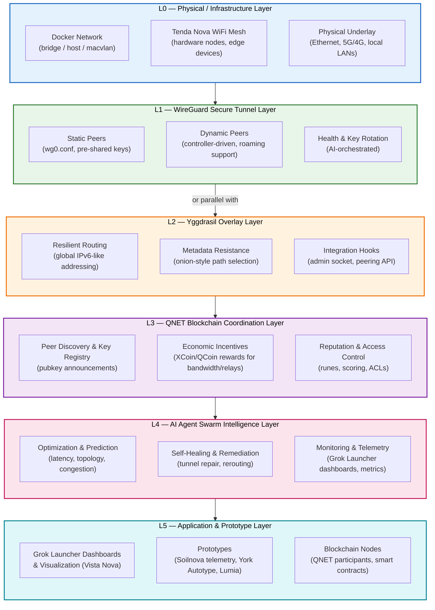

# Nexus Secure Mesh Architecture

**Layered communication fabric for the Nexus ecosystem** (xMesh / NovaNet / QNET + Yggdrasil + WireGuard + Blockchain + AI Swarms + Prototypes).

This document expands on the core architecture used by `nexus-wireguard` and the broader NovaNet prototyping initiative (Esslinger & Co.).

---

## Core Layered Diagram

*Layers are **composable** — WireGuard can sit under, over, or parallel to Yggdrasil depending on use case (performance vs privacy trade-offs).*

---

## Layer-by-Layer Breakdown

### L0 — Physical / Infrastructure Layer

**Responsibilities**
- Provide the raw connectivity substrate (Docker networking, Tenda Nova WiFi mesh hardware, Ethernet, cellular backhaul).
- Handle physical topology, power, environmental constraints (important for Soilnova outdoor sensors or mobile prototypes).

**Key Nuances & Edge Cases**
- Docker networking modes (bridge vs host vs macvlan) affect WireGuard performance and multicast behavior.
- Tenda Nova hardware: WiFi mesh backhaul quality varies with distance, interference, firmware; monitor RSSI and channel utilization.
- Intermittent connectivity (mobile nodes, solar-powered prototypes) requires robust roaming and tunnel re-establishment logic in upper layers.
- MTU discovery at this layer is foundational — misconfigurations cascade into fragmentation issues higher up.

**Integration Points**
- Exposes interfaces that L1 (WireGuard) binds to.
- Telemetry (link quality, throughput) fed upward to AI swarm for optimization.

---

### L1 — WireGuard Secure Tunnel Layer (Primary Focus of This Repo)

**Responsibilities**
- Establish confidential, authenticated, high-performance point-to-point and group tunnels.
- Support both static configurations and dynamic peer management (roaming, on-demand tunnels).
- Provide the confidentiality/integrity foundation that higher layers can trust.

**Key Nuances & Edge Cases**
- **Performance vs Privacy Trade-off**: Stacking WireGuard directly under Yggdrasil gives speed but less metadata protection. Running Yggdrasil under WireGuard (or parallel) changes the threat model.
- **Key Management**: Initial bootstrap, rotation, and revocation are non-trivial in a decentralized mesh. `nexus-wireguard` will provide controller hooks; long-term integration with L3 (QNET) for decentralized key registry.
- **MTU & Fragmentation**: WireGuard adds ~80 bytes. Nested tunnels require careful tuning (typical safe starting point: 1280–1420). Always enable PMTUD.
- **NAT Traversal & Roaming**: Excellent in most scenarios, but symmetric NAT/CGNAT or strict firewalls need relays or IPv6 preference (where Yggdrasil helps).
- **Monitoring**: Expose `wg show` metrics + interface stats to L4 AI agents for predictive maintenance.

**Implementation Priorities (nexus-wireguard)**
- Config templating and validation
- Dynamic peer controller (Python/Rust)
- Health checks and automated key rotation
- Docker-ready multi-arch images
- Integration points for L2 (Yggdrasil admin socket) and L3 (QNET pubkey announcements)

---

### L2 — Yggdrasil Overlay Layer

**Responsibilities**
- Global addressing (cryptographic IPv6-like addresses) independent of underlying IP changes.
- Resilient, self-organizing routing across heterogeneous underlays (including WireGuard tunnels).
- Metadata resistance through path selection and encryption.

**Key Nuances & Edge Cases**
- Yggdrasil can run **over** WireGuard (trusted high-speed links) or **under** it (WireGuard as an encrypted underlay for specific peer groups).
- Peering is flexible but can be noisy in large meshes — use `nexus-wireguard` + reputation from L3 to filter peers.
- Excellent complement to WireGuard for nodes that move frequently or operate behind difficult NAT.

**Synergies with WireGuard**
- WireGuard provides **speed + confidentiality** between trusted nodes.
- Yggdrasil provides **reachability + metadata resistance** across the wider network.
- Hybrid setups are a core research area for `nexus-wireguard` v0.3+.

---

### L3 — QNET Blockchain Coordination Layer

**Responsibilities**
- Decentralized peer discovery and public key registry (solve the bootstrap problem for WireGuard).
- Economic incentives (XCoin/QCoin) for providing bandwidth, relays, and uptime.
- Reputation scoring and access control (runes, smart-contract-like policies).
- Event logging and audit trail for the mesh fabric.

**Key Nuances & Edge Cases**
- **Token volatility & incentives**: Must design rewards that actually encourage healthy mesh behavior without encouraging spam or Sybil attacks.
- **On-chain vs off-chain**: Heavy data (full peer lists, large configs) should stay off-chain; blockchain used for commitments, reputation roots, and discovery indexes.
- **Bootstrapping the registry**: Early network needs seed nodes or trusted introducers; later becomes more permissionless via reputation.

**Integration with `nexus-wireguard`**
- Publish WireGuard public keys and endpoints to QNET.
- Listen for peer announcements and automatically establish tunnels to high-reputation nodes.
- Use on-chain events to trigger key rotation or policy updates.

---

### L4 — AI Agent Swarm Intelligence Layer

**Responsibilities**
- Continuous optimization of the entire stack (topology, tunnel selection, routing policies).
- Predictive healing: detect failing tunnels or degrading links before they impact applications.
- Telemetry aggregation and visualization (feed Grok Launcher dashboards).
- Self-improving loops: agents experiment with configurations, measure outcomes, and evolve strategies.

**Key Nuances & Edge Cases**
- **Agent drift & safety**: Self-improvement must stay within safe bounds (rate limits on config changes, human-in-the-loop for critical production meshes).
- **Observability**: Needs rich, low-latency metrics from L0–L3. `nexus-wireguard` must expose structured stats.
- **Coordination overhead**: Too many agents making simultaneous changes can destabilize the mesh — requires consensus or leader election mechanisms (possibly via QNET).

**Synergies**
- Lyra (emotional/creative) + Xen (technical/exploratory) agents can collaborate on narrative-driven optimization scenarios and hard technical tuning.
- Grok Launcher provides the human-visible control plane and simulation environment.

---

### L5 — Application & Prototype Layer

**Responsibilities**
- Deliver end-user and developer value: dashboards, visualizations, sensor data, automation, blockchain participation.
- Consume the reliable, secure, observable communication fabric provided by L0–L4.

**Examples**
- **Grok Launcher**: Real-time mesh health dashboards, tunnel topology views, AI-proposed reconfigurations.
- **Soilnova**: Secure telemetry upload from environmental sensors over encrypted tunnels.
- **Vista Nova**: Low-latency visualization streams protected by WireGuard + Yggdrasil hybrid paths.
- **York Autotype / Lumia**: Command & control channels for automation and lighting prototypes.
- **Blockchain nodes**: QNET participants running full nodes or light clients over the secure fabric.

---

## Cross-Cutting Concerns

### Security & Privacy (Defense in Depth)
- **L1 (WireGuard)**: Confidentiality + integrity between authenticated peers.
- **L2 (Yggdrasil)**: Metadata resistance and routing obfuscation.
- **L3 (QNET)**: Reputation-based access control and economic deterrence of bad actors.
- **L4 (AI)**: Anomaly detection, automated response to suspicious patterns.
- **Overall**: Never rely on a single layer. Assume partial compromise and design for graceful degradation.

### Observability & Monitoring
- Every layer must expose metrics (interface stats, RTT, loss, peer health, token balances, agent decisions).
- Grok Launcher acts as the unified observability surface.
- AI agents use this data for closed-loop optimization.

### Self-Improvement & Evolution
- The architecture is explicitly designed for recursive improvement: L4 agents optimize L0–L3 configurations; successful patterns are reinforced via incentives (L3) and codified into higher-level policies.
- Long-term goal: the mesh fabric becomes increasingly autonomous while remaining auditable and aligned with human intent.

### Failure Modes & Resilience
- **Partial network partitions**: Yggdrasil + dynamic WireGuard tunnels provide multiple paths.
- **Key compromise**: Rapid rotation + reputation revocation via L3.
- **AI misbehavior**: Circuit breakers, human override via Grok Launcher, and conservative default policies.
- **Hardware failure** (Tenda Nova node dies): Automatic rerouting and peer replacement orchestrated by L4.

### Scalability Implications
- **Small meshes (< 50 nodes)**: Simple static + dynamic WireGuard sufficient.
- **Medium (50–500 nodes)**: Add L3 reputation filtering + L4 predictive optimization.
- **Large / global**: Hierarchical clustering, on-demand tunnels, heavy use of L2 Yggdrasil for reachability, economic incentives to sustain participation.

---

## Data Flow Summary

**Upward (telemetry & events)**
Physical link quality → WireGuard stats → Yggdrasil routing metrics → QNET on-chain events → AI agent observations → Application dashboards & alerts

**Downward (control & policy)**
AI optimization decisions → QNET policy updates & incentives → Yggdrasil peering config → WireGuard peer add/remove & key rotation → Physical interface adjustments (where possible)

**Lateral (peer-to-peer)**
Direct encrypted tunnels (WireGuard) carrying application traffic, Yggdrasil routed packets, or blockchain gossip.

---

## Implementation Roadmap for `nexus-wireguard`

This repository owns the **L1 WireGuard layer** while providing clean integration hooks to L0, L2, L3, and L4.

- **v0.1** (Current): Architecture documentation, static examples, Docker skeleton.
- **v0.2**: Dynamic peer controller + basic health monitoring (exposes data to L4).
- **v0.3**: QNET discovery integration (L3) — publish keys, listen for peers, reputation-weighted peering.
- **v0.4**: Full AI swarm hooks — accept optimization commands, report rich metrics, participate in self-healing loops.
- **v0.5+**: Production features (formal verification aids, post-quantum experiments, large-scale simulation harness).

---

**This architecture is a living document.** It will evolve as we build, test, and let the AI agents improve the system in real deployments.

*Maintained as part of the NovaNet / Esslinger & Co. prototyping initiative — Hannover, 2026.*